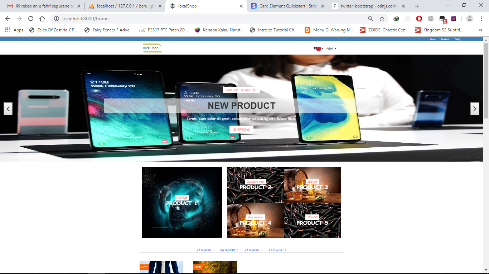
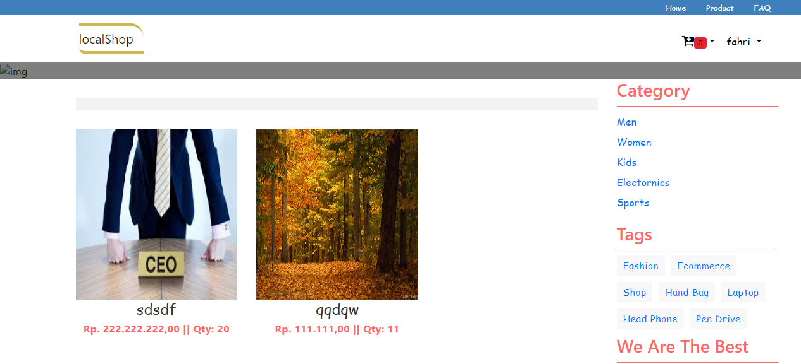
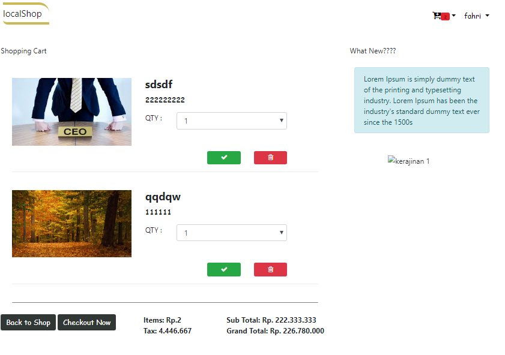
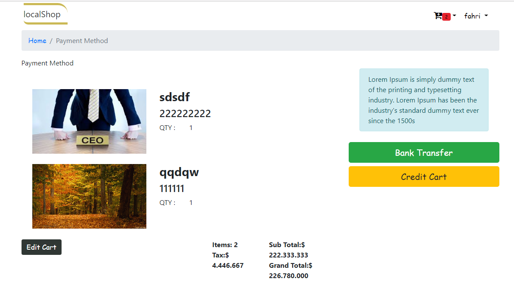
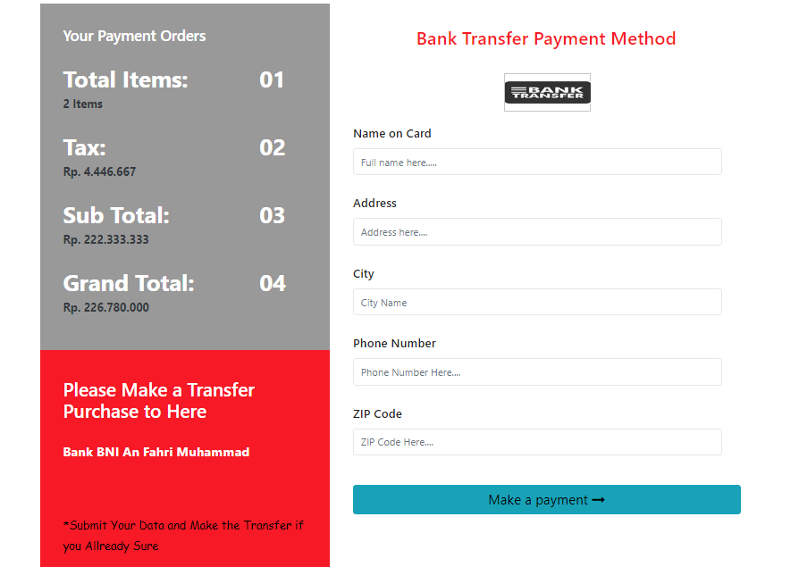
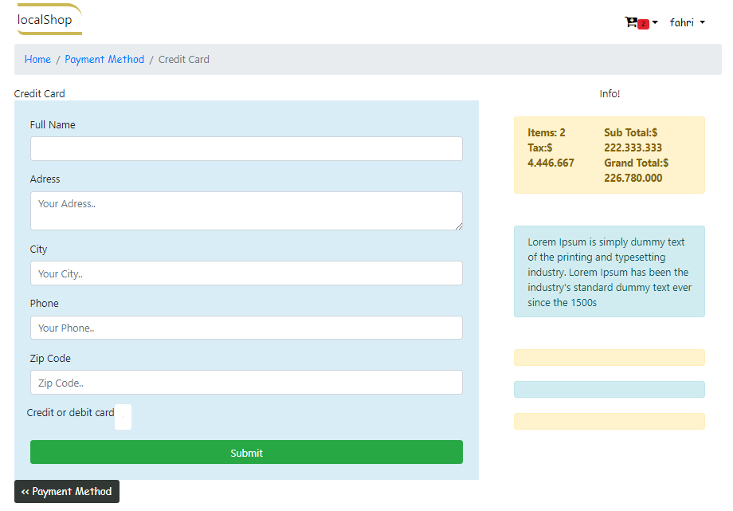

## Judul Project
<h2 style="color: red;" align="center">LocalShop: Dynamic e-commerce website, with admin panel and user panel  + Stripe Api Payments</h2> 
*based on my github Repo https://github.com/fahrim27

## Nama Kelompok
Fahri Muhammad (17051204029)  
Husni Mubarok  (17051204033)  
Alfin Falah S. (17051204040)  

## Fitur
<ol type="1">
	<li>Admin and User Panel</li>
	<li>Dynamic Product Crud</li>
	<li>Dynamic Shopping Cart</li>
	<li>Mail Verification adn Submitting (with mailtrap)</li>
	<li>Stripe Payment Api</li>
	<li>Admin Full Control Order (Accept, Rejected, and Pending)</li>
</ol>

## Demo Tampilan
<ul style="list-style-type:circle;">
	<li>Home </li>
	<li>Product item </li>
	<li>Cart (edited) </li>
	<li>Final Cart </li>
	<li>Bank Transfer Payment </li>
	<li>Stripe Payment </li>
	<li>Admin Product Panel </li>
	<li>Admin user Order </li>
</ul>

## Resource

## About Laravel

Laravel is a web application framework with expressive, elegant syntax. We believe development must be an enjoyable and creative experience to be truly fulfilling. Laravel attempts to take the pain out of development by easing common tasks used in the majority of web projects, such as:

Laravel is accessible, yet powerful, providing tools needed for large, robust applications.

## License

The Laravel framework is open-sourced software licensed under the [MIT license](https://opensource.org/licenses/MIT).

<h2 align="center">!!! Thanks for Your Attention !!!</h2>
