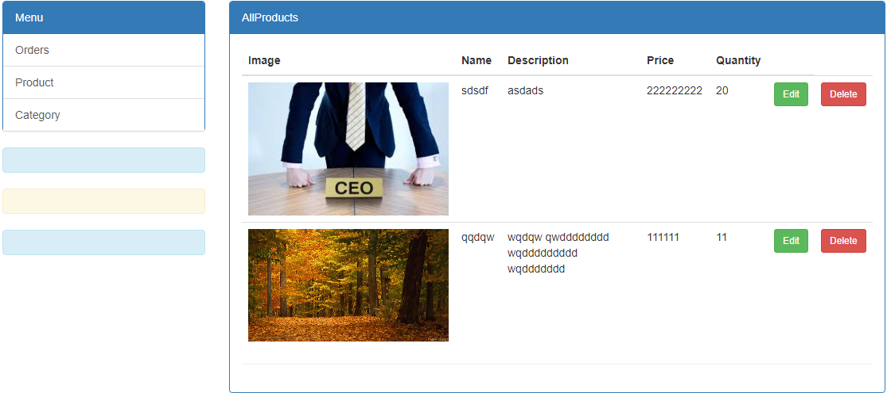
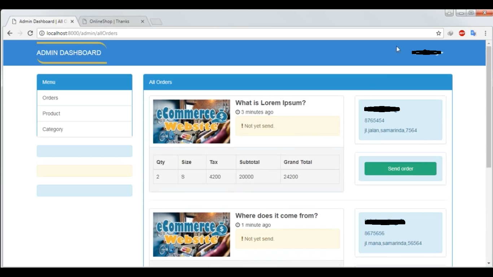

## Judul Project
<h2 style="color: red;" align="center">LocalShop: Dynamic e-commerce website, with admin panel and user panel  + Stripe Api Payments</h2>

## Nama Kelompok
Fahri Muhammad (17051204029)  
Husni Mubarok  (17051204030)  
Alfin Falah S. (17051204040)  

## Fitur
<ol type="1">
	<li>Admin and User Panel</li>
	<li>Dynamic Product Crud</li>
	<li>Dynamic Shopping Cart</li>
	<li>Mail Verification adn Submitting (with mailtrap)</li>
	<li>Stripe Payment Api</li>
	<li>Admin Full Control Order (Accept, Rejected, and Pending)</li>
</ol>

## Demo Tampilan
<ul style="list-style-type:circle;">
	<li>Home </li>
	<li>Product item </li>
	<li>Cart (edited) </li>
	<li>Final Cart </li>
	<li>Bank Transfer Payment </li>
	<li>Stripe Payment </li>
	<li>Admin Product Panel </li>
	<li>Admin user Order </li>
</ul>

## About Laravel

Laravel is a web application framework with expressive, elegant syntax. We believe development must be an enjoyable and creative experience to be truly fulfilling. Laravel attempts to take the pain out of development by easing common tasks used in the majority of web projects, such as:

- [Simple, fast routing engine](https://laravel.com/docs/routing).
- [Powerful dependency injection container](https://laravel.com/docs/container).
- Multiple back-ends for [session](https://laravel.com/docs/session) and [cache](https://laravel.com/docs/cache) storage.
- Expressive, intuitive [database ORM](https://laravel.com/docs/eloquent).
- Database agnostic [schema migrations](https://laravel.com/docs/migrations).
- [Robust background job processing](https://laravel.com/docs/queues).
- [Real-time event broadcasting](https://laravel.com/docs/broadcasting).

Laravel is accessible, yet powerful, providing tools needed for large, robust applications.

## Learning Laravel

Laravel has the most extensive and thorough [documentation](https://laravel.com/docs) and video tutorial library of any modern web application framework, making it a breeze to get started learning the framework.

If you're not in the mood to read, [Laracasts](https://laracasts.com) contains over 1100 video tutorials on a range of topics including Laravel, modern PHP, unit testing, JavaScript, and more. Boost the skill level of yourself and your entire team by digging into our comprehensive video library.

## License

The Laravel framework is open-sourced software licensed under the [MIT license](https://opensource.org/licenses/MIT).
